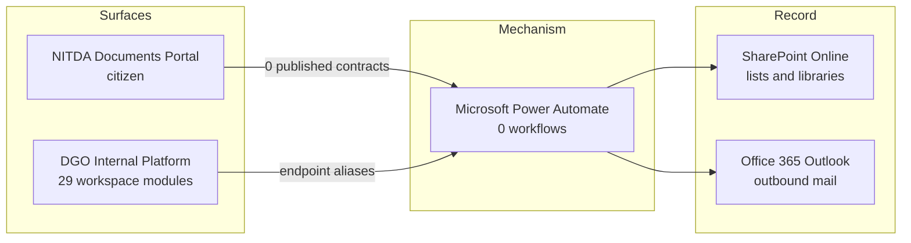

# 6. Enterprise process architecture

> **Generated.** Produced by `scripts/process-docs.mjs` from `docs/reference/process-inventory.json`,
> which `scripts/process-discovery.mjs` builds by reading the artifacts in this repository.
> Do not edit this file: edit the artifact, or the script that reads it, and regenerate.
> Inventory generated 2026-08-28. Standard `dgo-process-documentation/v2`.

**Purpose.** Show how the parts of the estate stand in relation to one another before descending into any one of them.

## Systems

| ID | System | Role in the estate | Evidence | Source |
| --- | --- | --- | --- | --- |
| SYS-001 | DGO Internal Platform | Browser-delivered operational platform used by registry, directorate and executive staff. Holds the workspace modules, the lifecycle machine and the role model. | Confirmed | `SRC-001` config/routes.config.js `SRC-002` core/boot.js |
| SYS-002 | Microsoft Power Automate | The sole integration mechanism. Every call from either surface into the system of record is an HTTP-triggered flow. | Confirmed | `SRC-003` config/endpoints.config.js |

## The shape of the estate

Two surfaces, one system of record, and exactly one mechanism between them.

**Title.** Estate context. **Purpose.** Show every path between a surface and the system of record.
**Scope.** Systems only; no process appears here. **Legend.** A solid arrow is a call evidenced in
configuration or in a workflow definition. **Confirmed / inferred.** Every edge on this diagram is
confirmed: the contracts are declared, the aliases are declared, and the connector bindings are read
from the workflow definitions themselves.

The architectural fact worth stating: there is no server the agency runs. Every write reaches the
system of record through a Power Automate workflow, and there is no second path. That makes the flow
estate the whole of the integration surface, and it makes the workflow ownership record a
structural risk rather than a documentation nicety.

## Modules

| ID | Route | Name | Group | Boundary role | Owned features | Must not own |
| --- | --- | --- | --- | --- | --- | --- |
| MOD-001 | `acknowledgment` | Acknowledgment Queue | OPERATIONS | assignment-receipt-gate | acknowledge acknowledge-retry remind-assignee escalate-non-ack | task-progress response-monitoring |
| MOD-002 | `activities` | Activities | OPERATIONS | activity-lens | activity-view phase-filtering flag-document activity-lifecycle-routing activity-attachment-preview | intake-master registry-control approval-decision archive-execution |
| MOD-003 | `approvals` | Review & Approval | CONTROL | standard-review-authority | approve approve-with-edit return reject review-minute | executive-exception-only dispatch-execution |
| MOD-004 | `archive` | Archive Evidence | CLOSURE | immutable-archive-execution | archive-reference archive-file archive-readiness archive-hash archive-access | registry-custody lookup-search report-generation |
| MOD-005 | `assistant` | Assistant | SYSTEM | governed-ai-assist | ask summarize suggest-next-action | raw-state-access unauthorized-action |
| MOD-006 | `briefs` | Briefs & Submissions | CONTROL | decision-pack | create-brief submit-brief decide-brief | intake-master registry-custody archive-execution task-execution |
| MOD-007 | `bulk-assignment` | Bulk Assignment | OPERATIONS | bulk-task-assignment | bulk-assign bulk-validation otp-protected-batch partial-results | task-execution approval-decision |
| MOD-008 | `comments` | Comments | OPERATIONS | collaboration-thread | comment review-note return-reason dispatch-note | status-transition archive-mutation |
| MOD-009 | `correspondence-email` | Correspondence Email Desk | CLOSURE | official-correspondence-email-dispatch | create-correspondence-email-draft send-correspondence-email duplicate-correspondence-email archive-correspondence-email | task-notification acknowledgement-receipt personal-mailbox |
| MOD-010 | `correspondence` | Intake & Assignment | OPERATIONS | intake-master | create-correspondence triage classify hold reject duplicate send-to-routing | registry-custody task-execution archive-execution |
| MOD-011 | `diagnostics` | System Health | SYSTEM | certification-health | run-checks contract-health route-health governance-health release-blockers | configuration-edit business-action |
| MOD-012 | `dispatch` | Dispatch | CLOSURE | dispatch-execution | prepare-dispatch send-dispatch retry-dispatch no-dispatch capture-receipt closure-check | approval-decision archive-execution |
| MOD-013 | `ecm-erp-charter` | ERP–ECM Charter | START HERE | boundary-charter | scope-boundary-charter ownership-matrix shared-terminology integration-rules delivery-sequencing | transaction-processing content-write-operations records-disposition-execution |
| MOD-014 | `executive` | DGCEO Correspondence & Decision Hub | CONTROL | executive-exception-authority | executive-approve executive-return executive-escalate request-clarification | routine-approval-queue task-execution |
| MOD-015 | `fasttrack` | FastTrack SLA | CONTROL | priority-intervention | fasttrack urgent-assign escalate-priority notify-owner | normal-task-workbench formal-approval |
| MOD-016 | `home` | Command Center | START HERE | operational-landing | quick-entry workload-summary | certification formal-reporting archive-execution |
| MOD-017 | `lookup` | Lookup & Direct Action | OPERATIONS | search-retrieval | search filter open-active open-archive | archive-execution report-generation |
| MOD-018 | `meetings` | Meetings | CONTROL | engagement-schedule | request-meeting decide-meeting meeting-actions-to-tasks | intake-master registry-custody approval-decision archive-execution |
| MOD-019 | `operator-hud` | Operator HUD | SYSTEM | runtime-monitoring | sync-status pending-queue runtime-load operator-alerts | configuration-edit release-certification |
| MOD-020 | `orchestrator` | My Work | OPERATIONS | task-execution-workbench | start-work progress block resume complete-action submit-review update-task | assignment-creation review-decision |
| MOD-021 | `projects` | Projects | CONTROL | project-register | create-project update-project | intake-master registry-custody task-execution archive-execution |
| MOD-022 | `registry` | Registry | OPERATIONS | official-file-control | registry-file file-jacket custody movement minutes registry-closure-candidate | triage-master search-retrieval report-export |
| MOD-023 | `reports` | Reports | CONTROL | report-export-authority | generate-report print export email-report evidence-report | live-monitoring archive-execution |
| MOD-024 | `response-tracking` | Tracking & Monitoring | CONTROL | response-monitoring-lens | monitor-response ageing export-monitoring route-to-owner | task-execution approval-decision |
| MOD-025 | `scan-intake` | Registry Scan Intake | OPERATIONS | counter-deposit | scan-deposit deposit-custody-attribution | registry-custody triage approval-decision archive-execution |
| MOD-026 | `settings` | Administration | SYSTEM | configuration | profile theme density endpoint-restore state-import-export | runtime-certification live-monitoring |
| MOD-027 | `single-assignment` | Assignment Desk | OPERATIONS | single-task-assignment | assign-one validate-assignee create-task create-task-from-email route-task | bulk-actions task-execution |
| MOD-028 | `statistics` | Statistics | CONTROL | analytics-kpi | metrics trends phase-distribution sla-analytics | formal-report-generation runtime-certification |
| MOD-029 | `user-admin` | User Administration | SYSTEM | user-access-admin | create-user edit-user disable-user assign-role | business-workflow-action |
