# 8. Process hierarchy

> **Generated.** Produced by `scripts/process-docs.mjs` from `docs/reference/process-inventory.json`,
> which `scripts/process-discovery.mjs` builds by reading the artifacts in this repository.
> Do not edit this file: edit the artifact, or the script that reads it, and regenerate.
> Inventory generated 2026-08-28. Standard `dgo-process-documentation/v2`.

**Purpose.** Place every process and subprocess under a parent, so nothing floats unattached.

## Hierarchy by group

### START HERE — 2 process(es)

- **PROC-001** Command Center
- **PROC-002** ERP–ECM Charter

### OPERATIONS — 7 process(es)

- **PROC-003** Activities
  - _SUBPROC-051_ Save the work state (Reusable governed write)
  - _SUBPROC-056_ Mark the document (Reusable governed write)
  - _SUBPROC-063_ Archive the activity (Reusable governed write)
  - _SUBPROC-064_ Route the activity to SIWES (Reusable governed write)
  - _SUBPROC-065_ Route the activity to NYSC (Reusable governed write)
  - ~VAR-005~ variant: mark the document — raised from lookup
- **PROC-004** Intake & Assignment
  - _SUBPROC-001_ Assignment Desk (Sub-view of a primary workspace)
  - _SUBPROC-002_ Bulk Assignment (Sub-view of a primary workspace)
  - _SUBPROC-006_ Log the correspondence (Reusable governed write)
  - _SUBPROC-016_ Update the record (Reusable governed write)
  - _SUBPROC-059_ Turn the email into a correspondence record (Reusable governed write)
  - ~VAR-001~ variant: log the correspondence — raised from scan-intake
- **PROC-005** My Work
  - _SUBPROC-021_ Start work on that task (Reusable governed write)
  - _SUBPROC-022_ Mark that work complete (Reusable governed write)
  - _SUBPROC-052_ Set the reminder (Reusable governed write)
  - _SUBPROC-057_ Update the task (Reusable governed write)
  - ~VAR-006~ variant: update the task — raised from lookup
  - ~VAR-014~ variant: Support request — Timeline / Due Date Issue
- **PROC-006** Acknowledgment Queue
  - _SUBPROC-019_ Record the acknowledgment (Reusable governed write)
  - _SUBPROC-020_ Send the acknowledgments still waiting (Reusable governed write)
  - _SUBPROC-045_ Send the reminder (Reusable governed write)
  - ~VAR-002~ variant: record the acknowledgment — raised from orchestrator
  - ~VAR-018~ variant: Support request — Already Acknowledged
- **PROC-007** Registry
  - _SUBPROC-003_ Registry Scan Intake (Sub-view of a primary workspace)
  - _SUBPROC-046_ Register the file (Reusable governed write)
  - _SUBPROC-047_ Route the file (Reusable governed write)
  - _SUBPROC-048_ Record receipt of the file (Reusable governed write)
  - _SUBPROC-049_ Close the file (Reusable governed write)
- **PROC-008** Comments
  - _SUBPROC-044_ Add the comment (Reusable governed write)
  - ~VAR-015~ variant: Support request — Clarification Required
- **PROC-009** Lookup & Direct Action
  - ~VAR-017~ variant: Support request — Wrong Task or Reference

### CONTROL — 9 process(es)

- **PROC-010** Tracking & Monitoring
- **PROC-011** FastTrack SLA
  - _SUBPROC-062_ Resolve the escalation (Reusable governed write)
- **PROC-012** Review & Approval
  - _SUBPROC-023_ Record the approval (Reusable governed write)
  - _SUBPROC-038_ Raise the approval request (Reusable governed write)
  - _SUBPROC-039_ Record the rejection (Reusable governed write)
- **PROC-013** Briefs & Submissions
  - _SUBPROC-007_ Create the brief (Reusable governed write)
  - _SUBPROC-008_ Submit the brief (Reusable governed write)
  - _SUBPROC-009_ Record the decision on the brief (Reusable governed write)
- **PROC-014** Meetings
  - _SUBPROC-010_ Request the meeting (Reusable governed write)
  - _SUBPROC-011_ Record the decision on the meeting (Reusable governed write)
  - _SUBPROC-012_ Turn the meeting actions into tasks (Reusable governed write)
- **PROC-015** Projects
  - _SUBPROC-013_ Create the project (Reusable governed write)
  - _SUBPROC-014_ Update the project (Reusable governed write)
- **PROC-016** Reports
  - _SUBPROC-027_ Produce the report (Reusable governed write)
- **PROC-017** Statistics
- **PROC-018** DGCEO Correspondence & Decision Hub
  - _SUBPROC-024_ Record the executive approval (Reusable governed write)
  - _SUBPROC-040_ Return the item to the sender (Reusable governed write)
  - _SUBPROC-041_ Delegate the item (Reusable governed write)
  - _SUBPROC-042_ Add the minute (Reusable governed write)
  - ~VAR-009~ variant: Executive decision hub — as DGCEO
  - ~VAR-010~ variant: Executive decision hub — as Officer
  - ~VAR-011~ variant: Executive decision hub — as EA

### CLOSURE — 2 process(es)

- **PROC-019** Dispatch
  - _SUBPROC-004_ Archive Evidence (Sub-view of a primary workspace)
  - _SUBPROC-025_ Send the dispatch (Reusable governed write)
  - _SUBPROC-053_ Record that nothing will be dispatched (Reusable governed write)
  - _SUBPROC-054_ Send the dispatch again (Reusable governed write)
  - _SUBPROC-055_ Close the dispatch (Reusable governed write)
- **PROC-020** Correspondence Email Desk
  - _SUBPROC-029_ Save the letter draft (Reusable governed write)
  - _SUBPROC-030_ Send the letter (Reusable governed write)
  - _SUBPROC-031_ Duplicate the letter draft (Reusable governed write)
  - _SUBPROC-032_ Archive the letter (Reusable governed write)

### SYSTEM — 4 process(es)

- **PROC-021** Assistant
  - ~VAR-012~ variant: Support request — Access Error
- **PROC-022** Operator HUD
- **PROC-023** Administration
  - _SUBPROC-005_ User Administration (Sub-view of a primary workspace)
  - _SUBPROC-033_ Save your profile (Reusable governed write)
  - _SUBPROC-066_ Import that file (Reusable governed write)
- **PROC-024** System Health
  - _SUBPROC-028_ Run the system checks (Reusable governed write)
  - ~VAR-016~ variant: Support request — Offline / Queue Issue

## Hierarchy diagram

Groups, their processes and the subprocesses attached to each. Where a group carries more than twelve
processes the diagram shows the first twelve and the list above carries the rest; the diagram is an
aid, the list is the record.

```mermaid
flowchart TD
  G_START_HERE["START HERE"]
  G_START_HERE --> PROC_001["Command Center"]
  G_START_HERE --> PROC_002["ERP–ECM Charter"]
  G_OPERATIONS["OPERATIONS"]
  G_OPERATIONS --> PROC_003["Activities"]
  PROC_003 --> SUBPROC_051("Save the work state")
  PROC_003 --> SUBPROC_056("Mark the document")
  PROC_003 --> SUBPROC_063("Archive the activity")
  PROC_003 --> SUBPROC_064("Route the activity to SIWES")
  PROC_003 --> SUBPROC_065("Route the activity to NYSC")
  G_OPERATIONS --> PROC_004["Intake & Assignment"]
  PROC_004 --> SUBPROC_001("Assignment Desk")
  PROC_004 --> SUBPROC_002("Bulk Assignment")
  PROC_004 --> SUBPROC_006("Log the correspondence")
  PROC_004 --> SUBPROC_016("Update the record")
  PROC_004 --> SUBPROC_059("Turn the email into a correspondence record")
  G_OPERATIONS --> PROC_005["My Work"]
  PROC_005 --> SUBPROC_021("Start work on that task")
  PROC_005 --> SUBPROC_022("Mark that work complete")
  PROC_005 --> SUBPROC_052("Set the reminder")
  PROC_005 --> SUBPROC_057("Update the task")
  G_OPERATIONS --> PROC_006["Acknowledgment Queue"]
  PROC_006 --> SUBPROC_019("Record the acknowledgment")
  PROC_006 --> SUBPROC_020("Send the acknowledgments still waiting")
  PROC_006 --> SUBPROC_045("Send the reminder")
  G_OPERATIONS --> PROC_007["Registry"]
  PROC_007 --> SUBPROC_003("Registry Scan Intake")
  PROC_007 --> SUBPROC_046("Register the file")
  PROC_007 --> SUBPROC_047("Route the file")
  PROC_007 --> SUBPROC_048("Record receipt of the file")
  PROC_007 --> SUBPROC_049("Close the file")
  G_OPERATIONS --> PROC_008["Comments"]
  PROC_008 --> SUBPROC_044("Add the comment")
  G_OPERATIONS --> PROC_009["Lookup & Direct Action"]
  G_CONTROL["CONTROL"]
  G_CONTROL --> PROC_010["Tracking & Monitoring"]
  G_CONTROL --> PROC_011["FastTrack SLA"]
  PROC_011 --> SUBPROC_062("Resolve the escalation")
  G_CONTROL --> PROC_012["Review & Approval"]
  PROC_012 --> SUBPROC_023("Record the approval")
  PROC_012 --> SUBPROC_038("Raise the approval request")
  PROC_012 --> SUBPROC_039("Record the rejection")
  G_CONTROL --> PROC_013["Briefs & Submissions"]
  PROC_013 --> SUBPROC_007("Create the brief")
  PROC_013 --> SUBPROC_008("Submit the brief")
  PROC_013 --> SUBPROC_009("Record the decision on the brief")
  G_CONTROL --> PROC_014["Meetings"]
  PROC_014 --> SUBPROC_010("Request the meeting")
  PROC_014 --> SUBPROC_011("Record the decision on the meeting")
  PROC_014 --> SUBPROC_012("Turn the meeting actions into tasks")
  G_CONTROL --> PROC_015["Projects"]
  PROC_015 --> SUBPROC_013("Create the project")
  PROC_015 --> SUBPROC_014("Update the project")
  G_CONTROL --> PROC_016["Reports"]
  PROC_016 --> SUBPROC_027("Produce the report")
  G_CONTROL --> PROC_017["Statistics"]
  G_CONTROL --> PROC_018["DGCEO Correspondence & Decision Hub"]
  PROC_018 --> SUBPROC_024("Record the executive approval")
  PROC_018 --> SUBPROC_040("Return the item to the sender")
  PROC_018 --> SUBPROC_041("Delegate the item")
  PROC_018 --> SUBPROC_042("Add the minute")
  G_CLOSURE["CLOSURE"]
  G_CLOSURE --> PROC_019["Dispatch"]
  PROC_019 --> SUBPROC_004("Archive Evidence")
  PROC_019 --> SUBPROC_025("Send the dispatch")
  PROC_019 --> SUBPROC_053("Record that nothing will be dispatched")
  PROC_019 --> SUBPROC_054("Send the dispatch again")
  PROC_019 --> SUBPROC_055("Close the dispatch")
  G_CLOSURE --> PROC_020["Correspondence Email Desk"]
  PROC_020 --> SUBPROC_029("Save the letter draft")
  PROC_020 --> SUBPROC_030("Send the letter")
  PROC_020 --> SUBPROC_031("Duplicate the letter draft")
  PROC_020 --> SUBPROC_032("Archive the letter")
  G_SYSTEM["SYSTEM"]
  G_SYSTEM --> PROC_021["Assistant"]
  G_SYSTEM --> PROC_022["Operator HUD"]
  G_SYSTEM --> PROC_023["Administration"]
  PROC_023 --> SUBPROC_005("User Administration")
  PROC_023 --> SUBPROC_033("Save your profile")
  PROC_023 --> SUBPROC_066("Import that file")
  G_SYSTEM --> PROC_024["System Health"]
  PROC_024 --> SUBPROC_028("Run the system checks")
```

**Title.** Process hierarchy. **Purpose.** Show parentage for every process and subprocess.
**Scope.** Processes and subprocesses; no step, rule or status appears. **Legend.** A square node is a
process, a rounded node a subprocess, a plain node a group. **Confirmed / inferred.** Every parentage
shown is declared: a workspace group comes from the workspace configuration, a subprocess parent from
the governance table or the hidden-route declaration.

## Subprocesses with no placed parent

_None. Every subprocess resolves to a process record._
