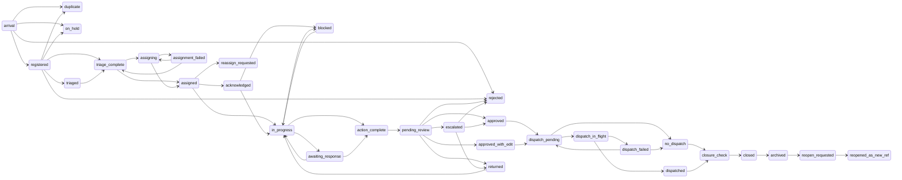

# 14. Status and transition catalogue

> **Generated.** Produced by `scripts/process-docs.mjs` from `docs/reference/process-inventory.json`,
> which `scripts/process-discovery.mjs` builds by reading the artifacts in this repository.
> Do not edit this file: edit the artifact, or the script that reads it, and regenerate.
> Inventory generated 2026-08-28. Standard `dgo-process-documentation/v2`.

**Purpose.** Record every state and every transition in each status model, with entry, exit, reversal, limits and audit behaviour, and say plainly which of those the evidence does not carry.

2 status models govern records in this estate. That is itself a finding, recorded in
the gap register: a record has a state in each, and the relationship between the two is only partly
declared.

## Model: Internal correspondence lifecycle — 31 states

| ID | State | Kind | Description | Entry condition | Entry gate | Permitted actions | Restricted actions | Responsible actor | Exit condition | Next states | Reversal | Time limits | Escalation | Notifications | Audit behaviour | Evidence | Sources |
| --- | --- | --- | --- | --- | --- | --- | --- | --- | --- | --- | --- | --- | --- | --- | --- | --- | --- |
| STAT-001 | acknowledged | Progression state | Lifecycle state 'acknowledged'. | Reached from assigned through canTransition(). | — | Transition to 'in_progress' Transition to 'blocked' | Any transition to a state other than in_progress, blocked, which canTransition() refuses. | Not evidenced. The transition map names states, not the actor permitted to move a record between them. | A caller requests a transition to one of in_progress, blocked. | in_progress blocked | No reverse edge is declared in the transition map. | Not evidenced. The transition map carries no clock; the service-level clocks live in the routing matrix and are not bound to a state here. | Not evidenced for this state. | Not evidenced. No notification is bound to a state in the transition map. | Not evidenced in the transition map. Audit vocabulary is bound to governed actions, not to states. | Confirmed | SRC-037 |
| STAT-002 | action_complete | Progression state | Lifecycle state 'action_complete'. | Reached from in_progress, awaiting_response through canTransition(). | Response evidence is required: a response, a summary or a task id. | Transition to 'pending_review' | Any transition to a state other than pending_review, which canTransition() refuses. | Not evidenced. The transition map names states, not the actor permitted to move a record between them. | A caller requests a transition to one of pending_review. | pending_review | No reverse edge is declared in the transition map. | Not evidenced. The transition map carries no clock; the service-level clocks live in the routing matrix and are not bound to a state here. | Not evidenced for this state. | Not evidenced. No notification is bound to a state in the transition map. | Not evidenced in the transition map. Audit vocabulary is bound to governed actions, not to states. | Confirmed | SRC-037 |
| STAT-003 | approved | Progression state | Lifecycle state 'approved'. | Reached from pending_review, escalated through canTransition(). | — | Transition to 'dispatch_pending' | Any transition to a state other than dispatch_pending, which canTransition() refuses. | Not evidenced. The transition map names states, not the actor permitted to move a record between them. | A caller requests a transition to one of dispatch_pending. | dispatch_pending | No reverse edge is declared in the transition map. | Not evidenced. The transition map carries no clock; the service-level clocks live in the routing matrix and are not bound to a state here. | Not evidenced for this state. | Not evidenced. No notification is bound to a state in the transition map. | Not evidenced in the transition map. Audit vocabulary is bound to governed actions, not to states. | Confirmed | SRC-037 |
| STAT-004 | approved_with_edit | Progression state | Lifecycle state 'approved_with_edit'. | Reached from pending_review through canTransition(). | An edit diff is required. | Transition to 'dispatch_pending' | Any transition to a state other than dispatch_pending, which canTransition() refuses. | Not evidenced. The transition map names states, not the actor permitted to move a record between them. | A caller requests a transition to one of dispatch_pending. | dispatch_pending | No reverse edge is declared in the transition map. | Not evidenced. The transition map carries no clock; the service-level clocks live in the routing matrix and are not bound to a state here. | Not evidenced for this state. | Not evidenced. No notification is bound to a state in the transition map. | Not evidenced in the transition map. Audit vocabulary is bound to governed actions, not to states. | Confirmed | SRC-037 |
| STAT-005 | archived | Progression state | Lifecycle state 'archived'. | Reached from closed through canTransition(). | — | Transition to 'reopen_requested' | Any transition to a state other than reopen_requested, which canTransition() refuses. | Not evidenced. The transition map names states, not the actor permitted to move a record between them. | A caller requests a transition to one of reopen_requested. | reopen_requested | No reverse edge is declared in the transition map. | Not evidenced. The transition map carries no clock; the service-level clocks live in the routing matrix and are not bound to a state here. | Not evidenced for this state. | Not evidenced. No notification is bound to a state in the transition map. | Not evidenced in the transition map. Audit vocabulary is bound to governed actions, not to states. | Confirmed | SRC-037 |
| STAT-006 | arrival | Progression state | Lifecycle state 'arrival'. | Not the target of any declared transition: this state can only be an origin. | — | Transition to 'registered' Transition to 'duplicate' Transition to 'rejected' Transition to 'on_hold' | Any transition to a state other than registered, duplicate, rejected, on_hold, which canTransition() refuses. | Not evidenced. The transition map names states, not the actor permitted to move a record between them. | A caller requests a transition to one of registered, duplicate, rejected, on_hold. | registered duplicate rejected on_hold | No reverse edge is declared in the transition map. | Not evidenced. The transition map carries no clock; the service-level clocks live in the routing matrix and are not bound to a state here. | Not evidenced for this state. | Not evidenced. No notification is bound to a state in the transition map. | Not evidenced in the transition map. Audit vocabulary is bound to governed actions, not to states. | Confirmed | SRC-037 |
| STAT-007 | assigned | Progression state | Lifecycle state 'assigned'. | Reached from triage_complete, assigning through canTransition(). | — | Transition to 'acknowledged' Transition to 'in_progress' Transition to 'reassign_requested' | Any transition to a state other than acknowledged, in_progress, reassign_requested, which canTransition() refuses. | Not evidenced. The transition map names states, not the actor permitted to move a record between them. | A caller requests a transition to one of acknowledged, in_progress, reassign_requested. | acknowledged in_progress reassign_requested | No reverse edge is declared in the transition map. | Not evidenced. The transition map carries no clock; the service-level clocks live in the routing matrix and are not bound to a state here. | Not evidenced for this state. | Not evidenced. No notification is bound to a state in the transition map. | Not evidenced in the transition map. Audit vocabulary is bound to governed actions, not to states. | Confirmed | SRC-037 |
| STAT-008 | assigning | Progression state | Lifecycle state 'assigning'. | Reached from triage_complete, assignment_failed through canTransition(). | — | Transition to 'assigned' Transition to 'assignment_failed' | Any transition to a state other than assigned, assignment_failed, which canTransition() refuses. | Not evidenced. The transition map names states, not the actor permitted to move a record between them. | A caller requests a transition to one of assigned, assignment_failed. | assigned assignment_failed | Reversible to assignment_failed: the map declares edges in both directions. | Not evidenced. The transition map carries no clock; the service-level clocks live in the routing matrix and are not bound to a state here. | Not evidenced for this state. | Not evidenced. No notification is bound to a state in the transition map. | Not evidenced in the transition map. Audit vocabulary is bound to governed actions, not to states. | Confirmed | SRC-037 |
| STAT-009 | assignment_failed | Exception state | Lifecycle state 'assignment_failed'. | Reached from assigning through canTransition(). | — | Transition to 'assigning' Transition to 'triage_complete' | Any transition to a state other than assigning, triage_complete, which canTransition() refuses. | Not evidenced. The transition map names states, not the actor permitted to move a record between them. | A caller requests a transition to one of assigning, triage_complete. | assigning triage_complete | Reversible to assigning: the map declares edges in both directions. | Not evidenced. The transition map carries no clock; the service-level clocks live in the routing matrix and are not bound to a state here. | Not evidenced for this state. | Not evidenced. No notification is bound to a state in the transition map. | Not evidenced in the transition map. Audit vocabulary is bound to governed actions, not to states. | Confirmed | SRC-037 |
| STAT-010 | awaiting_response | Progression state | Lifecycle state 'awaiting_response'. | Reached from in_progress through canTransition(). | — | Transition to 'in_progress' Transition to 'action_complete' | Any transition to a state other than in_progress, action_complete, which canTransition() refuses. | Not evidenced. The transition map names states, not the actor permitted to move a record between them. | A caller requests a transition to one of in_progress, action_complete. | in_progress action_complete | Reversible to in_progress: the map declares edges in both directions. | Not evidenced. The transition map carries no clock; the service-level clocks live in the routing matrix and are not bound to a state here. | Not evidenced for this state. | Not evidenced. No notification is bound to a state in the transition map. | Not evidenced in the transition map. Audit vocabulary is bound to governed actions, not to states. | Confirmed | SRC-037 |
| STAT-011 | blocked | Exception state | Lifecycle state 'blocked'. | Reached from acknowledged, in_progress through canTransition(). | — | Transition to 'in_progress' | Any transition to a state other than in_progress, which canTransition() refuses. | Not evidenced. The transition map names states, not the actor permitted to move a record between them. | A caller requests a transition to one of in_progress. | in_progress | Reversible to in_progress: the map declares edges in both directions. | Not evidenced. The transition map carries no clock; the service-level clocks live in the routing matrix and are not bound to a state here. | Not evidenced for this state. | Not evidenced. No notification is bound to a state in the transition map. | Not evidenced in the transition map. Audit vocabulary is bound to governed actions, not to states. | Confirmed | SRC-037 |
| STAT-012 | closed | Progression state | Lifecycle state 'closed'. | Reached from closure_check through canTransition(). | The closure gate must pass, through the caller-supplied canClose() helper. | Transition to 'archived' | Any transition to a state other than archived, which canTransition() refuses. | Not evidenced. The transition map names states, not the actor permitted to move a record between them. | A caller requests a transition to one of archived. | archived | No reverse edge is declared in the transition map. | Not evidenced. The transition map carries no clock; the service-level clocks live in the routing matrix and are not bound to a state here. | Not evidenced for this state. | Not evidenced. No notification is bound to a state in the transition map. | Not evidenced in the transition map. Audit vocabulary is bound to governed actions, not to states. | Confirmed | SRC-037 |
| STAT-013 | closure_check | Progression state | Lifecycle state 'closure_check'. | Reached from no_dispatch, dispatched through canTransition(). | — | Transition to 'closed' | Any transition to a state other than closed, which canTransition() refuses. | Not evidenced. The transition map names states, not the actor permitted to move a record between them. | A caller requests a transition to one of closed. | closed | No reverse edge is declared in the transition map. | Not evidenced. The transition map carries no clock; the service-level clocks live in the routing matrix and are not bound to a state here. | Not evidenced for this state. | Not evidenced. No notification is bound to a state in the transition map. | Not evidenced in the transition map. Audit vocabulary is bound to governed actions, not to states. | Confirmed | SRC-037 |
| STAT-014 | dispatch_failed | Exception state | Lifecycle state 'dispatch_failed'. | Reached from dispatch_in_flight through canTransition(). | — | Transition to 'dispatch_pending' Transition to 'no_dispatch' | Any transition to a state other than dispatch_pending, no_dispatch, which canTransition() refuses. | Not evidenced. The transition map names states, not the actor permitted to move a record between them. | A caller requests a transition to one of dispatch_pending, no_dispatch. | dispatch_pending no_dispatch | No reverse edge is declared in the transition map. | Not evidenced. The transition map carries no clock; the service-level clocks live in the routing matrix and are not bound to a state here. | Not evidenced for this state. | Not evidenced. No notification is bound to a state in the transition map. | Not evidenced in the transition map. Audit vocabulary is bound to governed actions, not to states. | Confirmed | SRC-037 |
| STAT-015 | dispatch_in_flight | Progression state | Lifecycle state 'dispatch_in_flight'. | Reached from dispatch_pending through canTransition(). | — | Transition to 'dispatched' Transition to 'dispatch_failed' | Any transition to a state other than dispatched, dispatch_failed, which canTransition() refuses. | Not evidenced. The transition map names states, not the actor permitted to move a record between them. | A caller requests a transition to one of dispatched, dispatch_failed. | dispatched dispatch_failed | No reverse edge is declared in the transition map. | Not evidenced. The transition map carries no clock; the service-level clocks live in the routing matrix and are not bound to a state here. | Not evidenced for this state. | Not evidenced. No notification is bound to a state in the transition map. | Not evidenced in the transition map. Audit vocabulary is bound to governed actions, not to states. | Confirmed | SRC-037 |
| STAT-016 | dispatch_pending | Progression state | Lifecycle state 'dispatch_pending'. | Reached from approved, approved_with_edit, dispatch_failed through canTransition(). | — | Transition to 'dispatch_in_flight' Transition to 'no_dispatch' | Any transition to a state other than dispatch_in_flight, no_dispatch, which canTransition() refuses. | Not evidenced. The transition map names states, not the actor permitted to move a record between them. | A caller requests a transition to one of dispatch_in_flight, no_dispatch. | dispatch_in_flight no_dispatch | No reverse edge is declared in the transition map. | Not evidenced. The transition map carries no clock; the service-level clocks live in the routing matrix and are not bound to a state here. | Not evidenced for this state. | Not evidenced. No notification is bound to a state in the transition map. | Not evidenced in the transition map. Audit vocabulary is bound to governed actions, not to states. | Confirmed | SRC-037 |
| STAT-017 | dispatched | Progression state | Lifecycle state 'dispatched'. | Reached from dispatch_in_flight through canTransition(). | — | Transition to 'closure_check' | Any transition to a state other than closure_check, which canTransition() refuses. | Not evidenced. The transition map names states, not the actor permitted to move a record between them. | A caller requests a transition to one of closure_check. | closure_check | No reverse edge is declared in the transition map. | Not evidenced. The transition map carries no clock; the service-level clocks live in the routing matrix and are not bound to a state here. | Not evidenced for this state. | Not evidenced. No notification is bound to a state in the transition map. | Not evidenced in the transition map. Audit vocabulary is bound to governed actions, not to states. | Confirmed | SRC-037 |
| STAT-018 | duplicate | Exception state | Lifecycle state 'duplicate'. | Reached from arrival, registered through canTransition(). | — | Self-transition only. canTransition() permits nothing else out of this state. | Every transition out of this state. | Not evidenced. The transition map names states, not the actor permitted to move a record between them. | None declared. | — | No reverse edge is declared in the transition map. | Not evidenced. The transition map carries no clock; the service-level clocks live in the routing matrix and are not bound to a state here. | Not evidenced for this state. | Not evidenced. No notification is bound to a state in the transition map. | Not evidenced in the transition map. Audit vocabulary is bound to governed actions, not to states. | Confirmed | SRC-037 |
| STAT-019 | escalated | Exception state | Lifecycle state 'escalated'. | Reached from pending_review through canTransition(). | — | Transition to 'approved' Transition to 'returned' Transition to 'rejected' | Any transition to a state other than approved, returned, rejected, which canTransition() refuses. | Not evidenced. The transition map names states, not the actor permitted to move a record between them. | A caller requests a transition to one of approved, returned, rejected. | approved returned rejected | No reverse edge is declared in the transition map. | Not evidenced. The transition map carries no clock; the service-level clocks live in the routing matrix and are not bound to a state here. | Not evidenced for this state. | Not evidenced. No notification is bound to a state in the transition map. | Not evidenced in the transition map. Audit vocabulary is bound to governed actions, not to states. | Confirmed | SRC-037 |
| STAT-020 | in_progress | Progression state | Lifecycle state 'in_progress'. | Reached from assigned, acknowledged, blocked, awaiting_response, returned through canTransition(). | — | Transition to 'awaiting_response' Transition to 'action_complete' Transition to 'blocked' | Any transition to a state other than awaiting_response, action_complete, blocked, which canTransition() refuses. | Not evidenced. The transition map names states, not the actor permitted to move a record between them. | A caller requests a transition to one of awaiting_response, action_complete, blocked. | awaiting_response action_complete blocked | Reversible to awaiting_response, blocked: the map declares edges in both directions. | Not evidenced. The transition map carries no clock; the service-level clocks live in the routing matrix and are not bound to a state here. | Not evidenced for this state. | Not evidenced. No notification is bound to a state in the transition map. | Not evidenced in the transition map. Audit vocabulary is bound to governed actions, not to states. | Confirmed | SRC-037 |
| STAT-021 | no_dispatch | Exception state | Lifecycle state 'no_dispatch'. | Reached from dispatch_pending, dispatch_failed through canTransition(). | A reason is required. | Transition to 'closure_check' | Any transition to a state other than closure_check, which canTransition() refuses. | Not evidenced. The transition map names states, not the actor permitted to move a record between them. | A caller requests a transition to one of closure_check. | closure_check | No reverse edge is declared in the transition map. | Not evidenced. The transition map carries no clock; the service-level clocks live in the routing matrix and are not bound to a state here. | Not evidenced for this state. | Not evidenced. No notification is bound to a state in the transition map. | Not evidenced in the transition map. Audit vocabulary is bound to governed actions, not to states. | Confirmed | SRC-037 |
| STAT-022 | on_hold | Exception state | Lifecycle state 'on_hold'. | Reached from arrival, registered through canTransition(). | — | Self-transition only. canTransition() permits nothing else out of this state. | Every transition out of this state. | Not evidenced. The transition map names states, not the actor permitted to move a record between them. | None declared. | — | No reverse edge is declared in the transition map. | Not evidenced. The transition map carries no clock; the service-level clocks live in the routing matrix and are not bound to a state here. | Not evidenced for this state. | Not evidenced. No notification is bound to a state in the transition map. | Not evidenced in the transition map. Audit vocabulary is bound to governed actions, not to states. | Confirmed | SRC-037 |
| STAT-023 | pending_review | Progression state | Lifecycle state 'pending_review'. | Reached from action_complete through canTransition(). | — | Transition to 'approved' Transition to 'approved_with_edit' Transition to 'returned' Transition to 'escalated' Transition to 'rejected' | Any transition to a state other than approved, approved_with_edit, returned, escalated, rejected, which canTransition() refuses. | Not evidenced. The transition map names states, not the actor permitted to move a record between them. | A caller requests a transition to one of approved, approved_with_edit, returned, escalated, rejected. | approved approved_with_edit returned escalated rejected | No reverse edge is declared in the transition map. | Not evidenced. The transition map carries no clock; the service-level clocks live in the routing matrix and are not bound to a state here. | Escalation is a declared successor of this state. | Not evidenced. No notification is bound to a state in the transition map. | Not evidenced in the transition map. Audit vocabulary is bound to governed actions, not to states. | Confirmed | SRC-037 |
| STAT-024 | reassign_requested | Exception state | Lifecycle state 'reassign_requested'. | Reached from assigned through canTransition(). | — | Self-transition only. canTransition() permits nothing else out of this state. | Every transition out of this state. | Not evidenced. The transition map names states, not the actor permitted to move a record between them. | None declared. | — | No reverse edge is declared in the transition map. | Not evidenced. The transition map carries no clock; the service-level clocks live in the routing matrix and are not bound to a state here. | Not evidenced for this state. | Not evidenced. No notification is bound to a state in the transition map. | Not evidenced in the transition map. Audit vocabulary is bound to governed actions, not to states. | Confirmed | SRC-037 |
| STAT-025 | registered | Progression state | Lifecycle state 'registered'. | Reached from arrival through canTransition(). | — | Transition to 'triaged' Transition to 'duplicate' Transition to 'rejected' Transition to 'on_hold' Transition to 'triage_complete' | Any transition to a state other than triaged, duplicate, rejected, on_hold, triage_complete, which canTransition() refuses. | Not evidenced. The transition map names states, not the actor permitted to move a record between them. | A caller requests a transition to one of triaged, duplicate, rejected, on_hold, triage_complete. | triaged duplicate rejected on_hold triage_complete | No reverse edge is declared in the transition map. | Not evidenced. The transition map carries no clock; the service-level clocks live in the routing matrix and are not bound to a state here. | Not evidenced for this state. | Not evidenced. No notification is bound to a state in the transition map. | Not evidenced in the transition map. Audit vocabulary is bound to governed actions, not to states. | Confirmed | SRC-037 |
| STAT-026 | rejected | Exception state | Lifecycle state 'rejected'. | Reached from arrival, registered, pending_review, escalated through canTransition(). | — | Self-transition only. canTransition() permits nothing else out of this state. | Every transition out of this state. | Not evidenced. The transition map names states, not the actor permitted to move a record between them. | None declared. | — | No reverse edge is declared in the transition map. | Not evidenced. The transition map carries no clock; the service-level clocks live in the routing matrix and are not bound to a state here. | Not evidenced for this state. | Not evidenced. No notification is bound to a state in the transition map. | Not evidenced in the transition map. Audit vocabulary is bound to governed actions, not to states. | Confirmed | SRC-037 |
| STAT-027 | reopen_requested | Progression state | Lifecycle state 'reopen_requested'. | Reached from archived through canTransition(). | — | Transition to 'reopened_as_new_ref' | Any transition to a state other than reopened_as_new_ref, which canTransition() refuses. | Not evidenced. The transition map names states, not the actor permitted to move a record between them. | A caller requests a transition to one of reopened_as_new_ref. | reopened_as_new_ref | No reverse edge is declared in the transition map. | Not evidenced. The transition map carries no clock; the service-level clocks live in the routing matrix and are not bound to a state here. | Not evidenced for this state. | Not evidenced. No notification is bound to a state in the transition map. | Not evidenced in the transition map. Audit vocabulary is bound to governed actions, not to states. | Confirmed | SRC-037 |
| STAT-028 | reopened_as_new_ref | Terminal state | Lifecycle state 'reopened_as_new_ref'. | Reached from reopen_requested through canTransition(). | — | Self-transition only. canTransition() permits nothing else out of this state. | Every transition out of this state. | Not evidenced. The transition map names states, not the actor permitted to move a record between them. | None declared. | — | No reverse edge is declared in the transition map. | Not evidenced. The transition map carries no clock; the service-level clocks live in the routing matrix and are not bound to a state here. | Not evidenced for this state. | Not evidenced. No notification is bound to a state in the transition map. | Not evidenced in the transition map. Audit vocabulary is bound to governed actions, not to states. | Confirmed | SRC-037 |
| STAT-029 | returned | Exception state | Lifecycle state 'returned'. | Reached from pending_review, escalated through canTransition(). | A reason is required. | Transition to 'in_progress' | Any transition to a state other than in_progress, which canTransition() refuses. | Not evidenced. The transition map names states, not the actor permitted to move a record between them. | A caller requests a transition to one of in_progress. | in_progress | No reverse edge is declared in the transition map. | Not evidenced. The transition map carries no clock; the service-level clocks live in the routing matrix and are not bound to a state here. | Not evidenced for this state. | Not evidenced. No notification is bound to a state in the transition map. | Not evidenced in the transition map. Audit vocabulary is bound to governed actions, not to states. | Confirmed | SRC-037 |
| STAT-030 | triage_complete | Progression state | Lifecycle state 'triage_complete'. | Reached from registered, triaged, assignment_failed through canTransition(). | — | Transition to 'assigning' Transition to 'assigned' | Any transition to a state other than assigning, assigned, which canTransition() refuses. | Not evidenced. The transition map names states, not the actor permitted to move a record between them. | A caller requests a transition to one of assigning, assigned. | assigning assigned | No reverse edge is declared in the transition map. | Not evidenced. The transition map carries no clock; the service-level clocks live in the routing matrix and are not bound to a state here. | Not evidenced for this state. | Not evidenced. No notification is bound to a state in the transition map. | Not evidenced in the transition map. Audit vocabulary is bound to governed actions, not to states. | Confirmed | SRC-037 |
| STAT-031 | triaged | Progression state | Lifecycle state 'triaged'. | Reached from registered through canTransition(). | — | Transition to 'triage_complete' | Any transition to a state other than triage_complete, which canTransition() refuses. | Not evidenced. The transition map names states, not the actor permitted to move a record between them. | A caller requests a transition to one of triage_complete. | triage_complete | No reverse edge is declared in the transition map. | Not evidenced. The transition map carries no clock; the service-level clocks live in the routing matrix and are not bound to a state here. | Not evidenced for this state. | Not evidenced. No notification is bound to a state in the transition map. | Not evidenced in the transition map. Audit vocabulary is bound to governed actions, not to states. | Confirmed | SRC-037 |

## Model: Governed public status vocabulary — 7 states

| ID | State | Kind | Description | Entry condition | Entry gate | Permitted actions | Restricted actions | Responsible actor | Exit condition | Next states | Reversal | Time limits | Escalation | Notifications | Audit behaviour | Evidence | Sources |
| --- | --- | --- | --- | --- | --- | --- | --- | --- | --- | --- | --- | --- | --- | --- | --- | --- | --- |
| STAT-032 | received | Stage 1 of 4 | Logged in the registry and queued for validation. | Not evidenced in this configuration: the vocabulary declares the states, not the events that enter them. | — | Not evidenced. | Not evidenced. | Not evidenced. | Not evidenced. | Not declared. This vocabulary is a flat list of seven, not a transition map. | Not evidenced. | Not evidenced. | Not evidenced. | Not evidenced. | Not evidenced. | Confirmed | SRC-038 |
| STAT-033 | validation | Stage 2 of 4 | Documents are being checked for completeness. | Not evidenced in this configuration: the vocabulary declares the states, not the events that enter them. | — | Not evidenced. | Not evidenced. | Not evidenced. | Not evidenced. | Not declared. This vocabulary is a flat list of seven, not a transition map. | Not evidenced. | Not evidenced. | Not evidenced. | Not evidenced. | Not evidenced. | Confirmed | SRC-038 |
| STAT-034 | review | Stage 3 of 4 | With the assigned unit for technical assessment. | Not evidenced in this configuration: the vocabulary declares the states, not the events that enter them. | — | Not evidenced. | Not evidenced. | Not evidenced. | Not evidenced. | Not declared. This vocabulary is a flat list of seven, not a transition map. | Not evidenced. | Not evidenced. | Not evidenced. | Not evidenced. | Not evidenced. | Confirmed | SRC-038 |
| STAT-035 | action-required | Stage 3 of 4 | Something is needed from the submitter before this can continue. | Not evidenced in this configuration: the vocabulary declares the states, not the events that enter them. | — | Not evidenced. | Not evidenced. | Not evidenced. | Not evidenced. | Not declared. This vocabulary is a flat list of seven, not a transition map. | Not evidenced. | Not evidenced. | Not evidenced. | Not evidenced. | Not evidenced. | Confirmed | SRC-038 |
| STAT-036 | approved | Stage 4 of 4 | Decision issued. Outcome sent to the submitter. | Not evidenced in this configuration: the vocabulary declares the states, not the events that enter them. | — | Not evidenced. | Not evidenced. | Not evidenced. | Not evidenced. | Not declared. This vocabulary is a flat list of seven, not a transition map. | Not evidenced. | Not evidenced. | Not evidenced. | Not evidenced. | Not evidenced. | Confirmed | SRC-038 |
| STAT-037 | declined | Stage 4 of 4 | Not approved on this submission. | Not evidenced in this configuration: the vocabulary declares the states, not the events that enter them. | — | Not evidenced. | Not evidenced. | Not evidenced. | Not evidenced. | Not declared. This vocabulary is a flat list of seven, not a transition map. | Not evidenced. | Not evidenced. | Not evidenced. | Not evidenced. | Not evidenced. | Confirmed | SRC-038 |
| STAT-038 | withdrawn | Stage 4 of 4 | Closed at the request of the submitter. | Not evidenced in this configuration: the vocabulary declares the states, not the events that enter them. | — | Not evidenced. | Not evidenced. | Not evidenced. | Not evidenced. | Not declared. This vocabulary is a flat list of seven, not a transition map. | Not evidenced. | Not evidenced. | Not evidenced. | Not evidenced. | Not evidenced. | Confirmed | SRC-038 |

## Transitions — 56

| ID | Model | From | To | Triggering action | Required condition | Responsible | System response | Exception outcome | Evidence | Validation | Sources |
| --- | --- | --- | --- | --- | --- | --- | --- | --- | --- | --- | --- |
| TRAN-001 | Internal correspondence lifecycle | arrival | registered | A caller requests the transition. | canTransition('arrival','registered') permits it. | Not evidenced. The guard does not name an actor. | The transition is permitted and the record moves. | A transition to any other state is refused by canTransition() and the record stays in 'arrival'. | Confirmed | No external validation required | SRC-037 |
| TRAN-002 | Internal correspondence lifecycle | arrival | duplicate | A caller requests the transition. | canTransition('arrival','duplicate') permits it. | Not evidenced. The guard does not name an actor. | The transition is permitted and the record moves. | A transition to any other state is refused by canTransition() and the record stays in 'arrival'. | Confirmed | No external validation required | SRC-037 |
| TRAN-003 | Internal correspondence lifecycle | arrival | rejected | A caller requests the transition. | canTransition('arrival','rejected') permits it. | Not evidenced. The guard does not name an actor. | The transition is permitted and the record moves. | A transition to any other state is refused by canTransition() and the record stays in 'arrival'. | Confirmed | No external validation required | SRC-037 |
| TRAN-004 | Internal correspondence lifecycle | arrival | on_hold | A caller requests the transition. | canTransition('arrival','on_hold') permits it. | Not evidenced. The guard does not name an actor. | The transition is permitted and the record moves. | A transition to any other state is refused by canTransition() and the record stays in 'arrival'. | Confirmed | No external validation required | SRC-037 |
| TRAN-005 | Internal correspondence lifecycle | registered | triaged | A caller requests the transition. | canTransition('registered','triaged') permits it. | Not evidenced. The guard does not name an actor. | The transition is permitted and the record moves. | A transition to any other state is refused by canTransition() and the record stays in 'registered'. | Confirmed | No external validation required | SRC-037 |
| TRAN-006 | Internal correspondence lifecycle | registered | duplicate | A caller requests the transition. | canTransition('registered','duplicate') permits it. | Not evidenced. The guard does not name an actor. | The transition is permitted and the record moves. | A transition to any other state is refused by canTransition() and the record stays in 'registered'. | Confirmed | No external validation required | SRC-037 |
| TRAN-007 | Internal correspondence lifecycle | registered | rejected | A caller requests the transition. | canTransition('registered','rejected') permits it. | Not evidenced. The guard does not name an actor. | The transition is permitted and the record moves. | A transition to any other state is refused by canTransition() and the record stays in 'registered'. | Confirmed | No external validation required | SRC-037 |
| TRAN-008 | Internal correspondence lifecycle | registered | on_hold | A caller requests the transition. | canTransition('registered','on_hold') permits it. | Not evidenced. The guard does not name an actor. | The transition is permitted and the record moves. | A transition to any other state is refused by canTransition() and the record stays in 'registered'. | Confirmed | No external validation required | SRC-037 |
| TRAN-009 | Internal correspondence lifecycle | registered | triage_complete | A caller requests the transition. | canTransition('registered','triage_complete') permits it. | Not evidenced. The guard does not name an actor. | The transition is permitted and the record moves. | A transition to any other state is refused by canTransition() and the record stays in 'registered'. | Confirmed | No external validation required | SRC-037 |
| TRAN-010 | Internal correspondence lifecycle | triaged | triage_complete | A caller requests the transition. | canTransition('triaged','triage_complete') permits it. | Not evidenced. The guard does not name an actor. | The transition is permitted and the record moves. | A transition to any other state is refused by canTransition() and the record stays in 'triaged'. | Confirmed | No external validation required | SRC-037 |
| TRAN-011 | Internal correspondence lifecycle | triage_complete | assigning | A caller requests the transition. | canTransition('triage_complete','assigning') permits it. | Not evidenced. The guard does not name an actor. | The transition is permitted and the record moves. | A transition to any other state is refused by canTransition() and the record stays in 'triage_complete'. | Confirmed | No external validation required | SRC-037 |
| TRAN-012 | Internal correspondence lifecycle | triage_complete | assigned | A caller requests the transition. | canTransition('triage_complete','assigned') permits it. | Not evidenced. The guard does not name an actor. | The transition is permitted and the record moves. | A transition to any other state is refused by canTransition() and the record stays in 'triage_complete'. | Confirmed | No external validation required | SRC-037 |
| TRAN-013 | Internal correspondence lifecycle | assigning | assigned | A caller requests the transition. | canTransition('assigning','assigned') permits it. | Not evidenced. The guard does not name an actor. | The transition is permitted and the record moves. | A transition to any other state is refused by canTransition() and the record stays in 'assigning'. | Confirmed | No external validation required | SRC-037 |
| TRAN-014 | Internal correspondence lifecycle | assigning | assignment_failed | A caller requests the transition. | canTransition('assigning','assignment_failed') permits it. | Not evidenced. The guard does not name an actor. | The transition is permitted and the record moves. | A transition to any other state is refused by canTransition() and the record stays in 'assigning'. | Confirmed | No external validation required | SRC-037 |
| TRAN-015 | Internal correspondence lifecycle | assignment_failed | assigning | A caller requests the transition. | canTransition('assignment_failed','assigning') permits it. | Not evidenced. The guard does not name an actor. | The transition is permitted and the record moves. | A transition to any other state is refused by canTransition() and the record stays in 'assignment_failed'. | Confirmed | No external validation required | SRC-037 |
| TRAN-016 | Internal correspondence lifecycle | assignment_failed | triage_complete | A caller requests the transition. | canTransition('assignment_failed','triage_complete') permits it. | Not evidenced. The guard does not name an actor. | The transition is permitted and the record moves. | A transition to any other state is refused by canTransition() and the record stays in 'assignment_failed'. | Confirmed | No external validation required | SRC-037 |
| TRAN-017 | Internal correspondence lifecycle | assigned | acknowledged | A caller requests the transition. | canTransition('assigned','acknowledged') permits it. | Not evidenced. The guard does not name an actor. | The transition is permitted and the record moves. | A transition to any other state is refused by canTransition() and the record stays in 'assigned'. | Confirmed | No external validation required | SRC-037 |
| TRAN-018 | Internal correspondence lifecycle | assigned | in_progress | A caller requests the transition. | canTransition('assigned','in_progress') permits it. | Not evidenced. The guard does not name an actor. | The transition is permitted and the record moves. | A transition to any other state is refused by canTransition() and the record stays in 'assigned'. | Confirmed | No external validation required | SRC-037 |
| TRAN-019 | Internal correspondence lifecycle | assigned | reassign_requested | A caller requests the transition. | canTransition('assigned','reassign_requested') permits it. | Not evidenced. The guard does not name an actor. | The transition is permitted and the record moves. | A transition to any other state is refused by canTransition() and the record stays in 'assigned'. | Confirmed | No external validation required | SRC-037 |
| TRAN-020 | Internal correspondence lifecycle | acknowledged | in_progress | A caller requests the transition. | canTransition('acknowledged','in_progress') permits it. | Not evidenced. The guard does not name an actor. | The transition is permitted and the record moves. | A transition to any other state is refused by canTransition() and the record stays in 'acknowledged'. | Confirmed | No external validation required | SRC-037 |
| TRAN-021 | Internal correspondence lifecycle | acknowledged | blocked | A caller requests the transition. | canTransition('acknowledged','blocked') permits it. | Not evidenced. The guard does not name an actor. | The transition is permitted and the record moves. | A transition to any other state is refused by canTransition() and the record stays in 'acknowledged'. | Confirmed | No external validation required | SRC-037 |
| TRAN-022 | Internal correspondence lifecycle | in_progress | awaiting_response | A caller requests the transition. | canTransition('in_progress','awaiting_response') permits it. | Not evidenced. The guard does not name an actor. | The transition is permitted and the record moves. | A transition to any other state is refused by canTransition() and the record stays in 'in_progress'. | Confirmed | No external validation required | SRC-037 |
| TRAN-023 | Internal correspondence lifecycle | in_progress | action_complete | A caller requests the transition. | canTransition('in_progress','action_complete') permits it AND Response evidence is required: a response, a summary or a task id. | Not evidenced. The guard does not name an actor. | The gate is evaluated; a failing gate raises a validation error naming the target status. | A missing precondition raises an error and the record stays in 'in_progress'. | Confirmed | No external validation required | SRC-037 |
| TRAN-024 | Internal correspondence lifecycle | in_progress | blocked | A caller requests the transition. | canTransition('in_progress','blocked') permits it. | Not evidenced. The guard does not name an actor. | The transition is permitted and the record moves. | A transition to any other state is refused by canTransition() and the record stays in 'in_progress'. | Confirmed | No external validation required | SRC-037 |
| TRAN-025 | Internal correspondence lifecycle | blocked | in_progress | A caller requests the transition. | canTransition('blocked','in_progress') permits it. | Not evidenced. The guard does not name an actor. | The transition is permitted and the record moves. | A transition to any other state is refused by canTransition() and the record stays in 'blocked'. | Confirmed | No external validation required | SRC-037 |
| TRAN-026 | Internal correspondence lifecycle | awaiting_response | in_progress | A caller requests the transition. | canTransition('awaiting_response','in_progress') permits it. | Not evidenced. The guard does not name an actor. | The transition is permitted and the record moves. | A transition to any other state is refused by canTransition() and the record stays in 'awaiting_response'. | Confirmed | No external validation required | SRC-037 |
| TRAN-027 | Internal correspondence lifecycle | awaiting_response | action_complete | A caller requests the transition. | canTransition('awaiting_response','action_complete') permits it AND Response evidence is required: a response, a summary or a task id. | Not evidenced. The guard does not name an actor. | The gate is evaluated; a failing gate raises a validation error naming the target status. | A missing precondition raises an error and the record stays in 'awaiting_response'. | Confirmed | No external validation required | SRC-037 |
| TRAN-028 | Internal correspondence lifecycle | action_complete | pending_review | A caller requests the transition. | canTransition('action_complete','pending_review') permits it. | Not evidenced. The guard does not name an actor. | The transition is permitted and the record moves. | A transition to any other state is refused by canTransition() and the record stays in 'action_complete'. | Confirmed | No external validation required | SRC-037 |
| TRAN-029 | Internal correspondence lifecycle | pending_review | approved | A caller requests the transition. | canTransition('pending_review','approved') permits it. | Not evidenced. The guard does not name an actor. | The transition is permitted and the record moves. | A transition to any other state is refused by canTransition() and the record stays in 'pending_review'. | Confirmed | No external validation required | SRC-037 |
| TRAN-030 | Internal correspondence lifecycle | pending_review | approved_with_edit | A caller requests the transition. | canTransition('pending_review','approved_with_edit') permits it AND An edit diff is required. | Not evidenced. The guard does not name an actor. | The gate is evaluated; a failing gate raises a validation error naming the target status. | A missing precondition raises an error and the record stays in 'pending_review'. | Confirmed | No external validation required | SRC-037 |
| TRAN-031 | Internal correspondence lifecycle | pending_review | returned | A caller requests the transition. | canTransition('pending_review','returned') permits it AND A reason is required. | Not evidenced. The guard does not name an actor. | The gate is evaluated; a failing gate raises a validation error naming the target status. | A missing precondition raises an error and the record stays in 'pending_review'. | Confirmed | No external validation required | SRC-037 |
| TRAN-032 | Internal correspondence lifecycle | pending_review | escalated | A caller requests the transition. | canTransition('pending_review','escalated') permits it. | Not evidenced. The guard does not name an actor. | The transition is permitted and the record moves. | A transition to any other state is refused by canTransition() and the record stays in 'pending_review'. | Confirmed | No external validation required | SRC-037 |
| TRAN-033 | Internal correspondence lifecycle | pending_review | rejected | A caller requests the transition. | canTransition('pending_review','rejected') permits it. | Not evidenced. The guard does not name an actor. | The transition is permitted and the record moves. | A transition to any other state is refused by canTransition() and the record stays in 'pending_review'. | Confirmed | No external validation required | SRC-037 |
| TRAN-034 | Internal correspondence lifecycle | returned | in_progress | A caller requests the transition. | canTransition('returned','in_progress') permits it. | Not evidenced. The guard does not name an actor. | The transition is permitted and the record moves. | A transition to any other state is refused by canTransition() and the record stays in 'returned'. | Confirmed | No external validation required | SRC-037 |
| TRAN-035 | Internal correspondence lifecycle | approved | dispatch_pending | A caller requests the transition. | canTransition('approved','dispatch_pending') permits it. | Not evidenced. The guard does not name an actor. | The transition is permitted and the record moves. | A transition to any other state is refused by canTransition() and the record stays in 'approved'. | Confirmed | No external validation required | SRC-037 |
| TRAN-036 | Internal correspondence lifecycle | approved_with_edit | dispatch_pending | A caller requests the transition. | canTransition('approved_with_edit','dispatch_pending') permits it. | Not evidenced. The guard does not name an actor. | The transition is permitted and the record moves. | A transition to any other state is refused by canTransition() and the record stays in 'approved_with_edit'. | Confirmed | No external validation required | SRC-037 |
| TRAN-037 | Internal correspondence lifecycle | escalated | approved | A caller requests the transition. | canTransition('escalated','approved') permits it. | Not evidenced. The guard does not name an actor. | The transition is permitted and the record moves. | A transition to any other state is refused by canTransition() and the record stays in 'escalated'. | Confirmed | No external validation required | SRC-037 |
| TRAN-038 | Internal correspondence lifecycle | escalated | returned | A caller requests the transition. | canTransition('escalated','returned') permits it AND A reason is required. | Not evidenced. The guard does not name an actor. | The gate is evaluated; a failing gate raises a validation error naming the target status. | A missing precondition raises an error and the record stays in 'escalated'. | Confirmed | No external validation required | SRC-037 |
| TRAN-039 | Internal correspondence lifecycle | escalated | rejected | A caller requests the transition. | canTransition('escalated','rejected') permits it. | Not evidenced. The guard does not name an actor. | The transition is permitted and the record moves. | A transition to any other state is refused by canTransition() and the record stays in 'escalated'. | Confirmed | No external validation required | SRC-037 |
| TRAN-040 | Internal correspondence lifecycle | dispatch_pending | dispatch_in_flight | A caller requests the transition. | canTransition('dispatch_pending','dispatch_in_flight') permits it. | Not evidenced. The guard does not name an actor. | The transition is permitted and the record moves. | A transition to any other state is refused by canTransition() and the record stays in 'dispatch_pending'. | Confirmed | No external validation required | SRC-037 |
| TRAN-041 | Internal correspondence lifecycle | dispatch_pending | no_dispatch | A caller requests the transition. | canTransition('dispatch_pending','no_dispatch') permits it AND A reason is required. | Not evidenced. The guard does not name an actor. | The gate is evaluated; a failing gate raises a validation error naming the target status. | A missing precondition raises an error and the record stays in 'dispatch_pending'. | Confirmed | No external validation required | SRC-037 |
| TRAN-042 | Internal correspondence lifecycle | dispatch_in_flight | dispatched | A caller requests the transition. | canTransition('dispatch_in_flight','dispatched') permits it. | Not evidenced. The guard does not name an actor. | The transition is permitted and the record moves. | A transition to any other state is refused by canTransition() and the record stays in 'dispatch_in_flight'. | Confirmed | No external validation required | SRC-037 |
| TRAN-043 | Internal correspondence lifecycle | dispatch_in_flight | dispatch_failed | A caller requests the transition. | canTransition('dispatch_in_flight','dispatch_failed') permits it. | Not evidenced. The guard does not name an actor. | The transition is permitted and the record moves. | A transition to any other state is refused by canTransition() and the record stays in 'dispatch_in_flight'. | Confirmed | No external validation required | SRC-037 |
| TRAN-044 | Internal correspondence lifecycle | dispatch_failed | dispatch_pending | A caller requests the transition. | canTransition('dispatch_failed','dispatch_pending') permits it. | Not evidenced. The guard does not name an actor. | The transition is permitted and the record moves. | A transition to any other state is refused by canTransition() and the record stays in 'dispatch_failed'. | Confirmed | No external validation required | SRC-037 |
| TRAN-045 | Internal correspondence lifecycle | dispatch_failed | no_dispatch | A caller requests the transition. | canTransition('dispatch_failed','no_dispatch') permits it AND A reason is required. | Not evidenced. The guard does not name an actor. | The gate is evaluated; a failing gate raises a validation error naming the target status. | A missing precondition raises an error and the record stays in 'dispatch_failed'. | Confirmed | No external validation required | SRC-037 |
| TRAN-046 | Internal correspondence lifecycle | no_dispatch | closure_check | A caller requests the transition. | canTransition('no_dispatch','closure_check') permits it. | Not evidenced. The guard does not name an actor. | The transition is permitted and the record moves. | A transition to any other state is refused by canTransition() and the record stays in 'no_dispatch'. | Confirmed | No external validation required | SRC-037 |
| TRAN-047 | Internal correspondence lifecycle | dispatched | closure_check | A caller requests the transition. | canTransition('dispatched','closure_check') permits it. | Not evidenced. The guard does not name an actor. | The transition is permitted and the record moves. | A transition to any other state is refused by canTransition() and the record stays in 'dispatched'. | Confirmed | No external validation required | SRC-037 |
| TRAN-048 | Internal correspondence lifecycle | closure_check | closed | A caller requests the transition. | canTransition('closure_check','closed') permits it AND The closure gate must pass, through the caller-supplied canClose() helper. | Not evidenced. The guard does not name an actor. | The gate is evaluated; a failing gate raises a validation error naming the target status. | A missing precondition raises an error and the record stays in 'closure_check'. | Confirmed | No external validation required | SRC-037 |
| TRAN-049 | Internal correspondence lifecycle | closed | archived | A caller requests the transition. | canTransition('closed','archived') permits it. | Not evidenced. The guard does not name an actor. | The transition is permitted and the record moves. | A transition to any other state is refused by canTransition() and the record stays in 'closed'. | Confirmed | No external validation required | SRC-037 |
| TRAN-050 | Internal correspondence lifecycle | archived | reopen_requested | A caller requests the transition. | canTransition('archived','reopen_requested') permits it. | Not evidenced. The guard does not name an actor. | The transition is permitted and the record moves. | A transition to any other state is refused by canTransition() and the record stays in 'archived'. | Confirmed | No external validation required | SRC-037 |
| TRAN-051 | Internal correspondence lifecycle | reopen_requested | reopened_as_new_ref | A caller requests the transition. | canTransition('reopen_requested','reopened_as_new_ref') permits it. | Not evidenced. The guard does not name an actor. | The transition is permitted and the record moves. | A transition to any other state is refused by canTransition() and the record stays in 'reopen_requested'. | Confirmed | No external validation required | SRC-037 |
| TRAN-052 | Internal-to-public status mapping | internal 'Pending' | public 'received' | A public surface renders the status of a record held internally. | None. The mapping is total over the five internal values it names. | governedStatusLabel(), called by the rendering surface. | The public label is shown in place of the internal value. | A status the map does not know is shown verbatim rather than translated. | Confirmed | No external validation required | SRC-038 |
| TRAN-053 | Internal-to-public status mapping | internal 'Accepted' | public 'review' | A public surface renders the status of a record held internally. | None. The mapping is total over the five internal values it names. | governedStatusLabel(), called by the rendering surface. | The public label is shown in place of the internal value. | A status the map does not know is shown verbatim rather than translated. | Conflicting | Requires confirmation by the named owner | SRC-038 |
| TRAN-054 | Internal-to-public status mapping | internal 'Delegated' | public 'review' | A public surface renders the status of a record held internally. | None. The mapping is total over the five internal values it names. | governedStatusLabel(), called by the rendering surface. | The public label is shown in place of the internal value. | A status the map does not know is shown verbatim rather than translated. | Confirmed | No external validation required | SRC-038 |
| TRAN-055 | Internal-to-public status mapping | internal 'Declined' | public 'declined' | A public surface renders the status of a record held internally. | None. The mapping is total over the five internal values it names. | governedStatusLabel(), called by the rendering surface. | The public label is shown in place of the internal value. | A status the map does not know is shown verbatim rather than translated. | Confirmed | No external validation required | SRC-038 |
| TRAN-056 | Internal-to-public status mapping | internal 'Archived' | public 'approved' | A public surface renders the status of a record held internally. | None. The mapping is total over the five internal values it names. | governedStatusLabel(), called by the rendering surface. | The public label is shown in place of the internal value. | A status the map does not know is shown verbatim rather than translated. | Conflicting | Requires confirmation by the named owner | SRC-038 |

## State-transition diagram — internal correspondence lifecycle

**Title.** Internal correspondence lifecycle. **Purpose.** Show every transition the guard permits.
**Scope.** The internal lifecycle only; the public status vocabulary is a flat list and has no
transition map to draw. **Legend.** Each arrow is one declared edge of the frozen transition map; a
state with no outgoing arrow permits no transition out except to itself. **Confirmed / inferred.**
Every edge is confirmed from the map. Nothing on this diagram is inferred — and nothing that the map
does not carry, such as who may make a transition or how long a state may be held, appears on it.

## States that admit no exit

| State | Kind | Entered from | Consequence |
| --- | --- | --- | --- |
| duplicate | Exception state | Reached from arrival, registered through canTransition(). | canTransition() permits nothing out of this state except a self-transition. |
| on_hold | Exception state | Reached from arrival, registered through canTransition(). | canTransition() permits nothing out of this state except a self-transition. |
| reassign_requested | Exception state | Reached from assigned through canTransition(). | canTransition() permits nothing out of this state except a self-transition. |
| rejected | Exception state | Reached from arrival, registered, pending_review, escalated through canTransition(). | canTransition() permits nothing out of this state except a self-transition. |
| reopened_as_new_ref | Terminal state | Reached from reopen_requested through canTransition(). | canTransition() permits nothing out of this state except a self-transition. |
