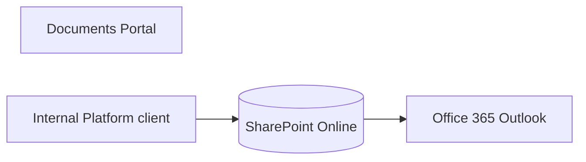

# 15. Integration-supported process catalogue

> **Generated.** Produced by `scripts/process-docs.mjs` from `docs/reference/process-inventory.json`,
> which `scripts/process-discovery.mjs` builds by reading the artifacts in this repository.
> Do not edit this file: edit the artifact, or the script that reads it, and regenerate.
> Inventory generated 2026-08-28. Standard `dgo-process-documentation/v2`.

**Purpose.** Record every published contract and every connector the estate actually calls, and which processes depend on each.

## Published contracts — 0

_No rows._

## Connectors in use, and the processes that call them

_No rows._

## Integration context diagram

**Title.** Integration context. **Purpose.** Show which published contract carries which citizen
interaction into the system of record. **Scope.** Published contracts only; internal endpoint aliases
are in document 16. **Legend.** A rectangle is a contract, a cylinder the system of record.
**Confirmed / inferred.** The contracts and their methods are confirmed from the data contract. The
edge from each contract to SharePoint is **inferred**: the contract declares a persistence target for
its fields, and the architecture states flows are the only mechanism, but no single artifact states
the whole path in one place.
