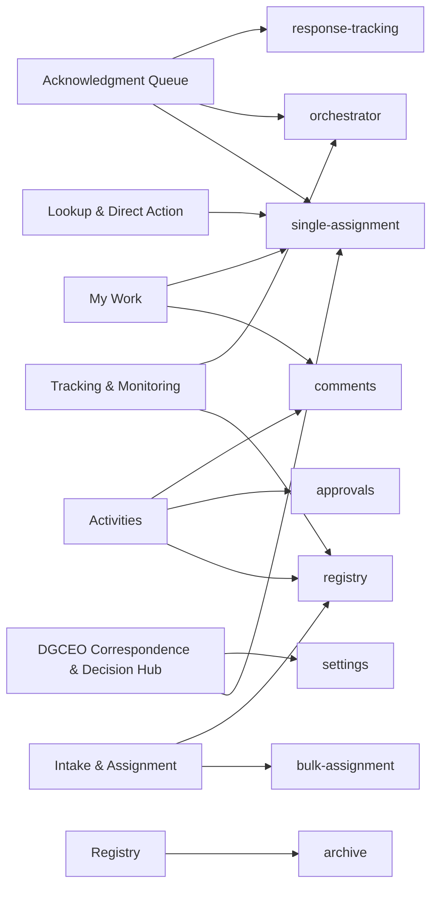

# 16. Process relationship and dependency map

> **Generated.** Produced by `scripts/process-docs.mjs` from `docs/reference/process-inventory.json`,
> which `scripts/process-discovery.mjs` builds by reading the artifacts in this repository.
> Do not edit this file: edit the artifact, or the script that reads it, and regenerate.
> Inventory generated 2026-08-28. Standard `dgo-process-documentation/v2`.

**Purpose.** Record every dependency with the thirteen attributes the standard requires, and draw the handoffs between workspaces.

## Dependencies — 52

| ID | Dependent process | Supporting | Supporting kind | Type | Direction | Mandatory | Activation condition | Operational purpose | Impact if unavailable | Documented workaround | Owner | Evidence | Validation | Sources |
| --- | --- | --- | --- | --- | --- | --- | --- | --- | --- | --- | --- | --- | --- | --- |
| DEP-001 | PROC-006 | Workspace response-tracking | Process | Process handoff | Downstream - this workspace sends the operator and the selected record on | Optional: the handoff is taken only on the path that navigates. | The operator takes the action that navigates to the other workspace. | The receiving workspace owns the step that follows. | The operator cannot complete the onward step from here; the record stays in its current state. | — | — | Confirmed | — | SRC-004 |
| DEP-002 | PROC-006 | Workspace orchestrator | Process | Process handoff | Downstream - this workspace sends the operator and the selected record on | Optional: the handoff is taken only on the path that navigates. | The operator takes the action that navigates to the other workspace. | The receiving workspace owns the step that follows. | The operator cannot complete the onward step from here; the record stays in its current state. | — | — | Confirmed | — | SRC-004 |
| DEP-003 | PROC-006 | Workspace single-assignment | Process | Process handoff | Downstream - this workspace sends the operator and the selected record on | Optional: the handoff is taken only on the path that navigates. | The operator takes the action that navigates to the other workspace. | The receiving workspace owns the step that follows. | The operator cannot complete the onward step from here; the record stays in its current state. | — | — | Confirmed | — | SRC-004 |
| DEP-004 | PROC-003 | Endpoint alias DYNAMIC_ACTIONS | Integration | Runtime integration call | Outbound - the workspace calls the endpoint | Not determinable from the call site alone; the governance table states per action whether the backend is required or optional. | The governed write this call accompanies is performed. | Carries the write through to the system of record. | The call fails. Whether the operator write survives depends on whether the action declares the backend required or optional. | Where the backend is optional, the record is kept locally and synchronisation is queued. | — | Confirmed | — | SRC-006 |
| DEP-005 | PROC-003 | Endpoint alias FETCH_EMAIL_ATTACHMENTS | Integration | Runtime integration call | Outbound - the workspace calls the endpoint | Not determinable from the call site alone; the governance table states per action whether the backend is required or optional. | The governed write this call accompanies is performed. | Carries the write through to the system of record. | The call fails. Whether the operator write survives depends on whether the action declares the backend required or optional. | Where the backend is optional, the record is kept locally and synchronisation is queued. | — | Confirmed | — | SRC-006 |
| DEP-006 | PROC-003 | Workspace comments | Process | Process handoff | Downstream - this workspace sends the operator and the selected record on | Optional: the handoff is taken only on the path that navigates. | The operator takes the action that navigates to the other workspace. | The receiving workspace owns the step that follows. | The operator cannot complete the onward step from here; the record stays in its current state. | — | — | Confirmed | — | SRC-006 |
| DEP-007 | PROC-003 | Workspace approvals | Process | Process handoff | Downstream - this workspace sends the operator and the selected record on | Optional: the handoff is taken only on the path that navigates. | The operator takes the action that navigates to the other workspace. | The receiving workspace owns the step that follows. | The operator cannot complete the onward step from here; the record stays in its current state. | — | — | Confirmed | — | SRC-006 |
| DEP-008 | PROC-003 | Workspace registry | Process | Process handoff | Downstream - this workspace sends the operator and the selected record on | Optional: the handoff is taken only on the path that navigates. | The operator takes the action that navigates to the other workspace. | The receiving workspace owns the step that follows. | The operator cannot complete the onward step from here; the record stays in its current state. | — | — | Confirmed | — | SRC-006 |
| DEP-009 | PROC-013 | Endpoint alias DYNAMIC_ACTIONS | Integration | Runtime integration call | Outbound - the workspace calls the endpoint | Not determinable from the call site alone; the governance table states per action whether the backend is required or optional. | The governed write this call accompanies is performed. | Carries the write through to the system of record. | The call fails. Whether the operator write survives depends on whether the action declares the backend required or optional. | Where the backend is optional, the record is kept locally and synchronisation is queued. | — | Confirmed | — | SRC-010 |
| DEP-010 | SUBPROC-002 | Endpoint alias BULK_ASSIGNMENT | Integration | Runtime integration call | Outbound - the workspace calls the endpoint | Not determinable from the call site alone; the governance table states per action whether the backend is required or optional. | The governed write this call accompanies is performed. | Carries the write through to the system of record. | The call fails. Whether the operator write survives depends on whether the action declares the backend required or optional. | Where the backend is optional, the record is kept locally and synchronisation is queued. | — | Confirmed | — | SRC-011 |
| DEP-011 | PROC-004 | Endpoint alias DYNAMIC_ACTIONS | Integration | Runtime integration call | Outbound - the workspace calls the endpoint | Not determinable from the call site alone; the governance table states per action whether the backend is required or optional. | The governed write this call accompanies is performed. | Carries the write through to the system of record. | The call fails. Whether the operator write survives depends on whether the action declares the backend required or optional. | Where the backend is optional, the record is kept locally and synchronisation is queued. | — | Confirmed | — | SRC-014 |
| DEP-012 | PROC-004 | Workspace registry | Process | Process handoff | Downstream - this workspace sends the operator and the selected record on | Optional: the handoff is taken only on the path that navigates. | The operator takes the action that navigates to the other workspace. | The receiving workspace owns the step that follows. | The operator cannot complete the onward step from here; the record stays in its current state. | — | — | Confirmed | — | SRC-014 |
| DEP-013 | PROC-004 | Workspace bulk-assignment | Process | Process handoff | Downstream - this workspace sends the operator and the selected record on | Optional: the handoff is taken only on the path that navigates. | The operator takes the action that navigates to the other workspace. | The receiving workspace owns the step that follows. | The operator cannot complete the onward step from here; the record stays in its current state. | — | — | Confirmed | — | SRC-014 |
| DEP-014 | PROC-018 | Endpoint alias DYNAMIC_ACTIONS | Integration | Runtime integration call | Outbound - the workspace calls the endpoint | Not determinable from the call site alone; the governance table states per action whether the backend is required or optional. | The governed write this call accompanies is performed. | Carries the write through to the system of record. | The call fails. Whether the operator write survives depends on whether the action declares the backend required or optional. | Where the backend is optional, the record is kept locally and synchronisation is queued. | — | Confirmed | — | SRC-018 |
| DEP-015 | PROC-018 | Workspace settings | Process | Process handoff | Downstream - this workspace sends the operator and the selected record on | Optional: the handoff is taken only on the path that navigates. | The operator takes the action that navigates to the other workspace. | The receiving workspace owns the step that follows. | The operator cannot complete the onward step from here; the record stays in its current state. | — | — | Confirmed | — | SRC-018 |
| DEP-016 | PROC-018 | Workspace single-assignment | Process | Process handoff | Downstream - this workspace sends the operator and the selected record on | Optional: the handoff is taken only on the path that navigates. | The operator takes the action that navigates to the other workspace. | The receiving workspace owns the step that follows. | The operator cannot complete the onward step from here; the record stays in its current state. | — | — | Confirmed | — | SRC-018 |
| DEP-017 | PROC-009 | Workspace single-assignment | Process | Process handoff | Downstream - this workspace sends the operator and the selected record on | Optional: the handoff is taken only on the path that navigates. | The operator takes the action that navigates to the other workspace. | The receiving workspace owns the step that follows. | The operator cannot complete the onward step from here; the record stays in its current state. | — | — | Confirmed | — | SRC-021 |
| DEP-018 | PROC-014 | Endpoint alias DYNAMIC_ACTIONS | Integration | Runtime integration call | Outbound - the workspace calls the endpoint | Not determinable from the call site alone; the governance table states per action whether the backend is required or optional. | The governed write this call accompanies is performed. | Carries the write through to the system of record. | The call fails. Whether the operator write survives depends on whether the action declares the backend required or optional. | Where the backend is optional, the record is kept locally and synchronisation is queued. | — | Confirmed | — | SRC-022 |
| DEP-019 | PROC-005 | Endpoint alias DYNAMIC_ACTIONS | Integration | Runtime integration call | Outbound - the workspace calls the endpoint | Not determinable from the call site alone; the governance table states per action whether the backend is required or optional. | The governed write this call accompanies is performed. | Carries the write through to the system of record. | The call fails. Whether the operator write survives depends on whether the action declares the backend required or optional. | Where the backend is optional, the record is kept locally and synchronisation is queued. | — | Confirmed | — | SRC-024 |
| DEP-020 | PROC-005 | Workspace single-assignment | Process | Process handoff | Downstream - this workspace sends the operator and the selected record on | Optional: the handoff is taken only on the path that navigates. | The operator takes the action that navigates to the other workspace. | The receiving workspace owns the step that follows. | The operator cannot complete the onward step from here; the record stays in its current state. | — | — | Confirmed | — | SRC-024 |
| DEP-021 | PROC-005 | Workspace comments | Process | Process handoff | Downstream - this workspace sends the operator and the selected record on | Optional: the handoff is taken only on the path that navigates. | The operator takes the action that navigates to the other workspace. | The receiving workspace owns the step that follows. | The operator cannot complete the onward step from here; the record stays in its current state. | — | — | Confirmed | — | SRC-024 |
| DEP-022 | PROC-015 | Endpoint alias DYNAMIC_ACTIONS | Integration | Runtime integration call | Outbound - the workspace calls the endpoint | Not determinable from the call site alone; the governance table states per action whether the backend is required or optional. | The governed write this call accompanies is performed. | Carries the write through to the system of record. | The call fails. Whether the operator write survives depends on whether the action declares the backend required or optional. | Where the backend is optional, the record is kept locally and synchronisation is queued. | — | Confirmed | — | SRC-025 |
| DEP-023 | PROC-007 | Endpoint alias DYNAMIC_ACTIONS | Integration | Runtime integration call | Outbound - the workspace calls the endpoint | Not determinable from the call site alone; the governance table states per action whether the backend is required or optional. | The governed write this call accompanies is performed. | Carries the write through to the system of record. | The call fails. Whether the operator write survives depends on whether the action declares the backend required or optional. | Where the backend is optional, the record is kept locally and synchronisation is queued. | — | Confirmed | — | SRC-026 |
| DEP-024 | PROC-007 | Workspace archive | Process | Process handoff | Downstream - this workspace sends the operator and the selected record on | Optional: the handoff is taken only on the path that navigates. | The operator takes the action that navigates to the other workspace. | The receiving workspace owns the step that follows. | The operator cannot complete the onward step from here; the record stays in its current state. | — | — | Confirmed | — | SRC-026 |
| DEP-025 | PROC-016 | Endpoint alias EMAIL | Integration | Runtime integration call | Outbound - the workspace calls the endpoint | Not determinable from the call site alone; the governance table states per action whether the backend is required or optional. | The governed write this call accompanies is performed. | Carries the write through to the system of record. | The call fails. Whether the operator write survives depends on whether the action declares the backend required or optional. | Where the backend is optional, the record is kept locally and synchronisation is queued. | — | Confirmed | — | SRC-027 |
| DEP-026 | PROC-010 | Endpoint alias DYNAMIC_ACTIONS | Integration | Runtime integration call | Outbound - the workspace calls the endpoint | Not determinable from the call site alone; the governance table states per action whether the backend is required or optional. | The governed write this call accompanies is performed. | Carries the write through to the system of record. | The call fails. Whether the operator write survives depends on whether the action declares the backend required or optional. | Where the backend is optional, the record is kept locally and synchronisation is queued. | — | Confirmed | — | SRC-028 |
| DEP-027 | PROC-010 | Workspace orchestrator | Process | Process handoff | Downstream - this workspace sends the operator and the selected record on | Optional: the handoff is taken only on the path that navigates. | The operator takes the action that navigates to the other workspace. | The receiving workspace owns the step that follows. | The operator cannot complete the onward step from here; the record stays in its current state. | — | — | Confirmed | — | SRC-028 |
| DEP-028 | PROC-010 | Workspace registry | Process | Process handoff | Downstream - this workspace sends the operator and the selected record on | Optional: the handoff is taken only on the path that navigates. | The operator takes the action that navigates to the other workspace. | The receiving workspace owns the step that follows. | The operator cannot complete the onward step from here; the record stays in its current state. | — | — | Confirmed | — | SRC-028 |
| DEP-029 | SUBPROC-003 | Endpoint alias DYNAMIC_ACTIONS | Integration | Runtime integration call | Outbound - the workspace calls the endpoint | Not determinable from the call site alone; the governance table states per action whether the backend is required or optional. | The governed write this call accompanies is performed. | Carries the write through to the system of record. | The call fails. Whether the operator write survives depends on whether the action declares the backend required or optional. | Where the backend is optional, the record is kept locally and synchronisation is queued. | — | Confirmed | — | SRC-029 |
| DEP-030 | SUBPROC-001 | Endpoint alias SINGLE_ASSIGNMENT | Integration | Runtime integration call | Outbound - the workspace calls the endpoint | Not determinable from the call site alone; the governance table states per action whether the backend is required or optional. | The governed write this call accompanies is performed. | Carries the write through to the system of record. | The call fails. Whether the operator write survives depends on whether the action declares the backend required or optional. | Where the backend is optional, the record is kept locally and synchronisation is queued. | — | Confirmed | — | SRC-031 |
| DEP-031 | PROC-017 | Endpoint alias EMAIL | Integration | Runtime integration call | Outbound - the workspace calls the endpoint | Not determinable from the call site alone; the governance table states per action whether the backend is required or optional. | The governed write this call accompanies is performed. | Carries the write through to the system of record. | The call fails. Whether the operator write survives depends on whether the action declares the backend required or optional. | Where the backend is optional, the record is kept locally and synchronisation is queued. | — | Confirmed | — | SRC-032 |
| DEP-032 | SUBPROC-005 | Endpoint alias DYNAMIC_ACTIONS | Integration | Runtime integration call | Outbound - the workspace calls the endpoint | Not determinable from the call site alone; the governance table states per action whether the backend is required or optional. | The governed write this call accompanies is performed. | Carries the write through to the system of record. | The call fails. Whether the operator write survives depends on whether the action declares the backend required or optional. | Where the backend is optional, the record is kept locally and synchronisation is queued. | — | Confirmed | — | SRC-033 |
| DEP-033 | DGO Internal Platform client | Endpoint FETCH_ACTIVITIES | Integration | Direct HTTP call to a Power Automate flow | Outbound | Declared in the endpoint registry as a named alias. Whether a given call is mandatory is stated per action in the governance table, not here. | A module resolves this alias and calls it. | The alias is the only name the client knows; the URL behind it is supplied at runtime. | Every call routed through this alias fails. | None declared at the registry level. | Not evidenced. The registry names the alias, not who owns the workflow behind it. | Confirmed | Requires confirmation against the live tenant | SRC-003 |
| DEP-034 | DGO Internal Platform client | Endpoint FETCH_ALL | Integration | Direct HTTP call to a Power Automate flow | Outbound | Declared in the endpoint registry as a named alias. Whether a given call is mandatory is stated per action in the governance table, not here. | A module resolves this alias and calls it. | The alias is the only name the client knows; the URL behind it is supplied at runtime. | Every call routed through this alias fails. | None declared at the registry level. | Not evidenced. The registry names the alias, not who owns the workflow behind it. | Confirmed | Requires confirmation against the live tenant | SRC-003 |
| DEP-035 | DGO Internal Platform client | Endpoint REFERENCE_DATA | Integration | Direct HTTP call to a Power Automate flow | Outbound | Declared in the endpoint registry as a named alias. Whether a given call is mandatory is stated per action in the governance table, not here. | A module resolves this alias and calls it. | The alias is the only name the client knows; the URL behind it is supplied at runtime. | Every call routed through this alias fails. | None declared at the registry level. | Not evidenced. The registry names the alias, not who owns the workflow behind it. | Confirmed | Requires confirmation against the live tenant | SRC-003 |
| DEP-036 | DGO Internal Platform client | Endpoint GET_DOCS | Integration | Direct HTTP call to a Power Automate flow | Outbound | Declared in the endpoint registry as a named alias. Whether a given call is mandatory is stated per action in the governance table, not here. | A module resolves this alias and calls it. | The alias is the only name the client knows; the URL behind it is supplied at runtime. | Every call routed through this alias fails. | None declared at the registry level. | Not evidenced. The registry names the alias, not who owns the workflow behind it. | Confirmed | Requires confirmation against the live tenant | SRC-003 |
| DEP-037 | PROC-003 | Endpoint FETCH_EMAIL_ATTACHMENTS | Integration | Direct HTTP call to a Power Automate flow | Outbound | Declared in the endpoint registry as a named alias. Whether a given call is mandatory is stated per action in the governance table, not here. | A module resolves this alias and calls it. | The alias is the only name the client knows; the URL behind it is supplied at runtime. | Every call routed through this alias fails. | None declared at the registry level. | Not evidenced. The registry names the alias, not who owns the workflow behind it. | Confirmed | Requires confirmation against the live tenant | SRC-003 |
| DEP-038 | SUBPROC-001 | Endpoint SINGLE_ASSIGNMENT | Integration | Direct HTTP call to a Power Automate flow | Outbound | Declared in the endpoint registry as a named alias. Whether a given call is mandatory is stated per action in the governance table, not here. | A module resolves this alias and calls it. | The alias is the only name the client knows; the URL behind it is supplied at runtime. | Every call routed through this alias fails. | None declared at the registry level. | Not evidenced. The registry names the alias, not who owns the workflow behind it. | Confirmed | Requires confirmation against the live tenant | SRC-003 |
| DEP-039 | SUBPROC-002 | Endpoint BULK_ASSIGNMENT | Integration | Direct HTTP call to a Power Automate flow | Outbound | Declared in the endpoint registry as a named alias. Whether a given call is mandatory is stated per action in the governance table, not here. | A module resolves this alias and calls it. | The alias is the only name the client knows; the URL behind it is supplied at runtime. | Every call routed through this alias fails. | None declared at the registry level. | Not evidenced. The registry names the alias, not who owns the workflow behind it. | Confirmed | Requires confirmation against the live tenant | SRC-003 |
| DEP-040 | DGO Internal Platform client | Endpoint BULK_ASSIGNMENT_DIRECT | Integration | Direct HTTP call to a Power Automate flow | Outbound | Declared in the endpoint registry as a named alias. Whether a given call is mandatory is stated per action in the governance table, not here. | A module resolves this alias and calls it. | The alias is the only name the client knows; the URL behind it is supplied at runtime. | Every call routed through this alias fails. | None declared at the registry level. | Not evidenced. The registry names the alias, not who owns the workflow behind it. | Confirmed | Requires confirmation against the live tenant | SRC-003 |
| DEP-041 | PROC-003, PROC-013, PROC-004, PROC-018, PROC-014, PROC-005, PROC-015, PROC-007, PROC-010, SUBPROC-003, SUBPROC-005 | Endpoint DYNAMIC_ACTIONS | Integration | Direct HTTP call to a Power Automate flow | Outbound | Declared in the endpoint registry as a named alias. Whether a given call is mandatory is stated per action in the governance table, not here. | A module resolves this alias and calls it. | The alias is the only name the client knows; the URL behind it is supplied at runtime. | Every call routed through this alias fails. | None declared at the registry level. | Not evidenced. The registry names the alias, not who owns the workflow behind it. | Confirmed | Requires confirmation against the live tenant | SRC-003 |
| DEP-042 | PROC-016, PROC-017 | Endpoint EMAIL | Integration | Direct HTTP call to a Power Automate flow | Outbound | Declared in the endpoint registry as a named alias. Whether a given call is mandatory is stated per action in the governance table, not here. | A module resolves this alias and calls it. | The alias is the only name the client knows; the URL behind it is supplied at runtime. | Every call routed through this alias fails. | None declared at the registry level. | Not evidenced. The registry names the alias, not who owns the workflow behind it. | Confirmed | Requires confirmation against the live tenant | SRC-003 |
| DEP-043 | DGO Internal Platform client | Endpoint EMAIL_RELATED_TASK | Integration | Direct HTTP call to a Power Automate flow | Outbound | Declared in the endpoint registry as a named alias. Whether a given call is mandatory is stated per action in the governance table, not here. | A module resolves this alias and calls it. | The alias is the only name the client knows; the URL behind it is supplied at runtime. | Every call routed through this alias fails. | None declared at the registry level. | Not evidenced. The registry names the alias, not who owns the workflow behind it. | Confirmed | Requires confirmation against the live tenant | SRC-003 |
| DEP-044 | DGO Internal Platform client | Endpoint AI_EMAIL_ANALYSIS | Integration | Direct HTTP call to a Power Automate flow | Outbound | Declared in the endpoint registry as a named alias. Whether a given call is mandatory is stated per action in the governance table, not here. | A module resolves this alias and calls it. | The alias is the only name the client knows; the URL behind it is supplied at runtime. | Every call routed through this alias fails. | None declared at the registry level. | Not evidenced. The registry names the alias, not who owns the workflow behind it. | Confirmed | Requires confirmation against the live tenant | SRC-003 |
| DEP-045 | DGO Internal Platform client | Endpoint AI_DOC_ANALYSIS | Integration | Direct HTTP call to a Power Automate flow | Outbound | Declared in the endpoint registry as a named alias. Whether a given call is mandatory is stated per action in the governance table, not here. | A module resolves this alias and calls it. | The alias is the only name the client knows; the URL behind it is supplied at runtime. | Every call routed through this alias fails. | None declared at the registry level. | Not evidenced. The registry names the alias, not who owns the workflow behind it. | Confirmed | Requires confirmation against the live tenant | SRC-003 |
| DEP-046 | DGO Internal Platform client | Endpoint AI_CHAT | Integration | Direct HTTP call to a Power Automate flow | Outbound | Declared in the endpoint registry as a named alias. Whether a given call is mandatory is stated per action in the governance table, not here. | A module resolves this alias and calls it. | The alias is the only name the client knows; the URL behind it is supplied at runtime. | Every call routed through this alias fails. | None declared at the registry level. | Not evidenced. The registry names the alias, not who owns the workflow behind it. | Confirmed | Requires confirmation against the live tenant | SRC-003 |
| DEP-047 | DGO Internal Platform client | Endpoint OTP_GENERATE | Integration | Direct HTTP call to a Power Automate flow | Outbound | Declared in the endpoint registry as a named alias. Whether a given call is mandatory is stated per action in the governance table, not here. | A module resolves this alias and calls it. | The alias is the only name the client knows; the URL behind it is supplied at runtime. | Every call routed through this alias fails. | None declared at the registry level. | Not evidenced. The registry names the alias, not who owns the workflow behind it. | Confirmed | Requires confirmation against the live tenant | SRC-003 |
| DEP-048 | DGO Internal Platform client | Endpoint OTP_VERIFY | Integration | Direct HTTP call to a Power Automate flow | Outbound | Declared in the endpoint registry as a named alias. Whether a given call is mandatory is stated per action in the governance table, not here. | A module resolves this alias and calls it. | The alias is the only name the client knows; the URL behind it is supplied at runtime. | Every call routed through this alias fails. | None declared at the registry level. | Not evidenced. The registry names the alias, not who owns the workflow behind it. | Confirmed | Requires confirmation against the live tenant | SRC-003 |
| DEP-049 | DGO Internal Platform client | Endpoint SUBSIDIARY_ACTIONS | Integration | Direct HTTP call to a Power Automate flow | Outbound | Declared in the endpoint registry as a named alias. Whether a given call is mandatory is stated per action in the governance table, not here. | A module resolves this alias and calls it. | The alias is the only name the client knows; the URL behind it is supplied at runtime. | Every call routed through this alias fails. | None declared at the registry level. | Not evidenced. The registry names the alias, not who owns the workflow behind it. | Confirmed | Requires confirmation against the live tenant | SRC-003 |
| DEP-050 | DGO Internal Platform client | Endpoint SCAN_INTAKE | Integration | Direct HTTP call to a Power Automate flow | Outbound | Declared in the endpoint registry as a named alias. Whether a given call is mandatory is stated per action in the governance table, not here. | A module resolves this alias and calls it. | The alias is the only name the client knows; the URL behind it is supplied at runtime. | Every call routed through this alias fails. | None declared at the registry level. | Not evidenced. The registry names the alias, not who owns the workflow behind it. | Confirmed | Requires confirmation against the live tenant | SRC-003 |
| DEP-051 | DGO Internal Platform client | Endpoint DISPATCH_OUTBOUND | Integration | Direct HTTP call to a Power Automate flow | Outbound | Declared in the endpoint registry as a named alias. Whether a given call is mandatory is stated per action in the governance table, not here. | A module resolves this alias and calls it. | The alias is the only name the client knows; the URL behind it is supplied at runtime. | Every call routed through this alias fails. | None declared at the registry level. | Not evidenced. The registry names the alias, not who owns the workflow behind it. | Confirmed | Requires confirmation against the live tenant | SRC-003 |
| DEP-052 | DGO Internal Platform client | Endpoint ARCHIVE_REFERENCE | Integration | Direct HTTP call to a Power Automate flow | Outbound | Declared in the endpoint registry as a named alias. Whether a given call is mandatory is stated per action in the governance table, not here. | A module resolves this alias and calls it. | The alias is the only name the client knows; the URL behind it is supplied at runtime. | Every call routed through this alias fails. | None declared at the registry level. | Not evidenced. The registry names the alias, not who owns the workflow behind it. | Confirmed | Requires confirmation against the live tenant | SRC-003 |

## Workspace handoff map

Each arrow is a navigation the source module performs in code, carrying the operator and the selected
record to another workspace.

**Title.** Workspace handoffs. **Purpose.** Show where a process ends and another begins for the same
record. **Scope.** Navigation handoffs between workspace modules; integration dependencies are in the
table above. **Legend.** An arrow points from the workspace that hands off to the one that receives.
**Confirmed / inferred.** Every arrow is confirmed: the destination route is a string literal in the
sending module.

## Relationship types the standard asks about

| Relationship | Recorded | Where |
| --- | --- | --- |
| Parent processes and subprocesses | 66 | Document 8 and document 10. |
| Processes and system modules | 29 modules mapped | Document 6 and each process record. |
| Processes and features | Yes, where a module boundary declares owned features | Document 6. |
| Processes and user actions | 58 operator steps | Document 11. |
| Processes and integrations | 36 | This document and document 15. |
| Processes and roles | Yes, by route access | Document 13. |
| Processes and business rules | 19 rules bound to a process | Document 12. |
| Processes and statuses | Partially: the lifecycle is not bound to a named process in any artifact | Document 14, and a gap in document 22. |
| Processes and reports | Not evidenced | No artifact declares a report drawn from a process. |
| Processes and configuration settings | Yes, by source citation on every record | Document 27. |
| Upstream and downstream processes | 16 handoffs | The map above. |
